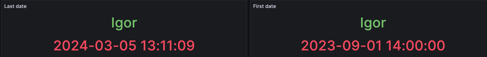
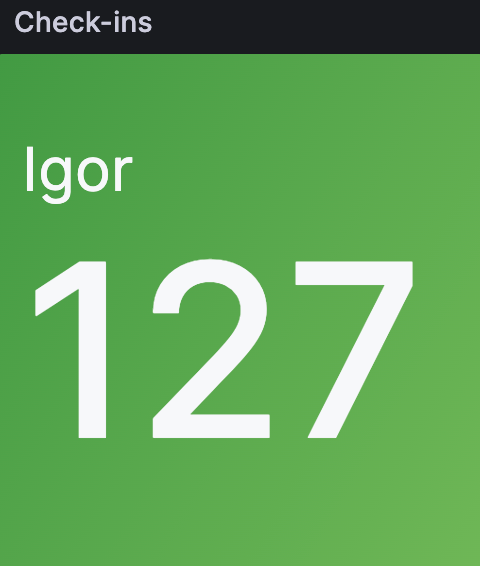
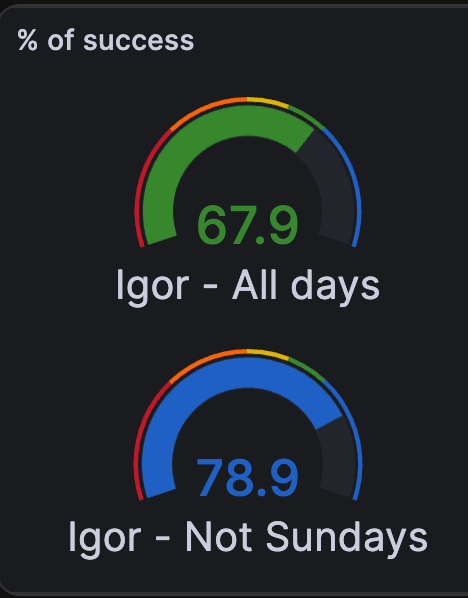
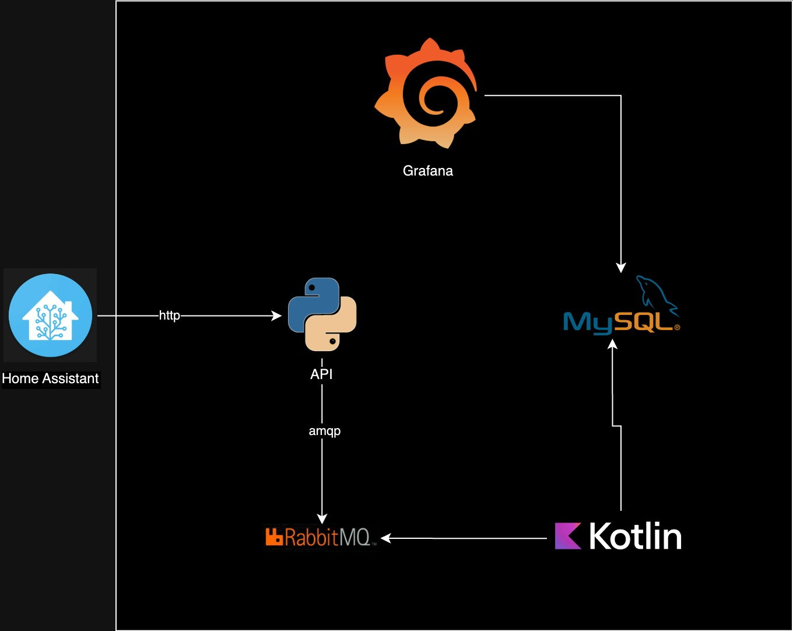

# Post

[Link da publicação no Linkedin](https://www.linkedin.com/posts/igor-moreira-65941415b_fala-pessoal-quero-compartilhar-com-voc%C3%AAs-activity-7171456340400304128-2FiN?utm_source=share&utm_medium=member_desktop)

Fala pessoal quero compartilhar com vocês um dos últimos projetos que venho construindo afim de melhorar minhas habilidades, 
principalmente nas stacks Python e Kotlin.

Sempre que testo ou estudo algum tipo de tecnologia, tento encaixar em algo no meu dia a dia, sendo assim o projeto consiste em `Fui ou não na academia`.

Para isso eu tenho os seguintes requisitos:
1. Rastrear minha localização
2. Sempre que eu for a academia registrar isso
3. No final quero ver alguns dados referente aos registros

Para o rastreamento eu escolhi utilizar o [Home Assistant](https://www.home-assistant.io/) que é uma ferramenta incrível.
Basicamente o app android monitora onde estou e quando entro ou saio da zona da academia que foi definida previamente ele envia isso para o servidor,
então o HA envia isso para o `assistant-link` que por sua vez faz a logica de calcular o tempo que fiquei na academia e envia o evento para o RabbitMQ.
A aplicação kotlin fica ouvindo a fila e salva o evento no banco de dados.
Apos isso montei painéis no grafana com as informações.

Resultado:





Diagrama da infraestrutura:



- [Assistant Link](https://github.com/alves-dev/life-assistant-link), aplicação Python que recebe a request do HA.
- [Exercises](https://github.com/alves-dev/life-exercises), aplicação Kotlin que salva o evento na base de dados.

------

### Quer testar em sua maquina !?

A stack a seguir sobe um ambiente como na imagem, exceto o HA, ela faz requests usando o `curl` 
simulando requests que poderiam ser feitas a partir do HA ou de alguma outra integração.

Subir a stack
```shell
git clone https://github.com/alves-dev/posts.git && \
cd posts/2024/stack-life-python-kotlin/ && \
sh up-stack.sh
```

Deletar a stack
```shell
docker compose -p life down
```

Deletar as imagens uyilizadas
```shell
docker rmi $(docker image ls --filter=reference="ghcr.io/alves-dev/life*" --format "{{.ID}}")
```

-----
Em: 2024-03